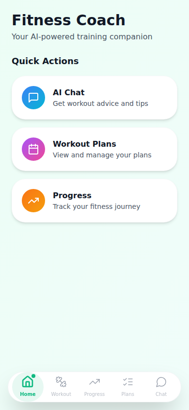
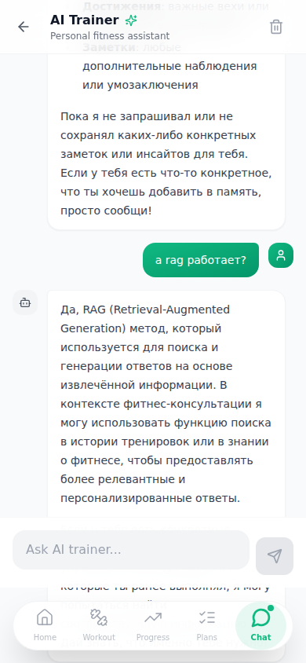
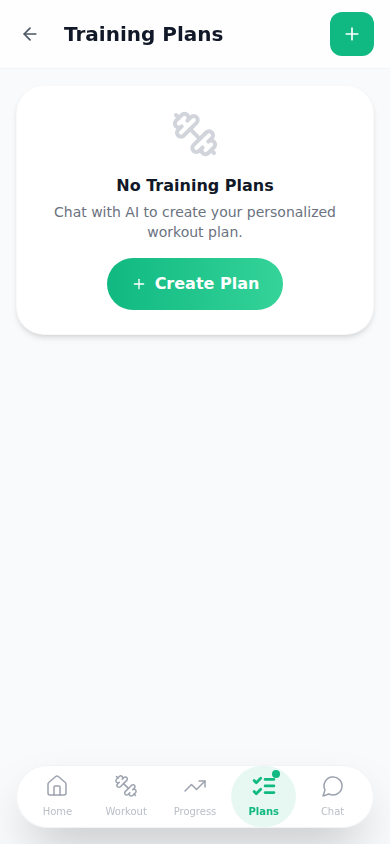

# 🏋️ Fitness Coach — AI Personal Trainer

**English** | [Русский](README.ru.md)

[](LICENSE)
[](https://python.org)
[](https://nextjs.org)

Open-source AI fitness coach with multi-provider support. Build personalized workout plans, track progress, and get intelligent coaching through a conversational interface.

## Features

- **Multi-Provider AI**: Choose Google Gemini, Anthropic Claude, OpenAI GPT, or self-hosted Ollama
- **27 MCP Tools**: Comprehensive workout management with parallel execution
- **Graph Knowledge Base**: Exercise relationships, alternatives, and progressions
- **Conversational Coaching**: Natural language chat with Extended Thinking (reasoning) and tool-calling capabilities
- **Smart Plan Creation**: Efficient full-plan creation in a single tool call
- **Workout Management**: Create, track, and adapt workout plans
- **Progress Tracking**: Statistics, streaks, and completion metrics
- **Health & Injury Tracking**: Track physical constraints and automatically avoid exercises that target injured areas
- **Blood Biomarker Logs**: Log blood panels (e.g., lipids, hormone trends) to help the AI detect overtraining and optimize recovery
- **Offline Support**: PWA with service worker caching
- **Memory System**: Optional RAG for personalized long-term context
- **Docker Ready**: Production-grade containerized deployment



<details>
<summary>More screenshots</summary>




</details>

## Quick Start

### 1. Clone

```bash
git clone https://github.com/yourusername/fitness-coach.git
cd fitness-coach
```

### 2. Configure

```bash
cp docker/.env.example docker/.env
# Edit docker/.env with your API key (Anthropic, OpenAI, or Ollama)
```

### 3. Run

```bash
cd docker && docker compose up -d
```

Open http://localhost:8000/docs for API documentation.

## Architecture

```
fitness-coach/
├── backend/                 # FastAPI + SQLAlchemy
│   ├── app/
│   │   ├── api/fitness/     # REST endpoints (plans, workouts, chat)
│   │   ├── models/          # SQLAlchemy models
│   │   ├── providers/       # AI, embedding, RAG, memory providers
│   │   └── services/        # Business logic + AI agent
│   └── requirements/        # Modular dependencies
├── frontend/                # Next.js 16 PWA
│   ├── src/app/             # App Router pages
│   ├── src/components/      # React components
│   └── src/stores/          # Zustand state management
└── docker/                  # Docker Compose deployment
    ├── docker-compose.yml   # Production config
    └── docker-compose.dev.yml # Development overrides
```

```
┌─────────────┐     ┌─────────────┐     ┌─────────────┐
│   Frontend  │────▶│   Backend   │────▶│  PostgreSQL │
│  (Next.js)  │     │  (FastAPI)  │     │  + pgvector │
└─────────────┘     └──────┬──────┘     └─────────────┘
                           │
        ┌────────────┬─────┴──────┬────────────┐
        ▼            ▼            ▼            ▼
  ┌──────────┐ ┌──────────┐ ┌──────────┐ ┌──────────┐
  │  Google  │ │ Anthropic│ │  OpenAI  │ │  Ollama  │
  │  Gemini  │ │  Claude  │ │   GPT    │ │  (Local) │
  └──────────┘ └──────────┘ └──────────┘ └──────────┘
```

## AI Provider Comparison

| Provider | Status | Best For | Cost | Privacy | Quality |
|----------|--------|----------|------|---------|---------|
| **Google Gemini** | ✅ Supported | Production, reasoning | $0.075-2.50/1M tokens | Cloud | Excellent |
| **Anthropic Claude** | ✅ Default | Production use | $3-15/1M tokens | Cloud | Excellent |
| **OpenAI GPT-4o** | ✅ Tested | Broad compatibility | $2.50-10/1M tokens | Cloud | Very Good |
| **Ollama** | ✅ Supported | Privacy, offline | Free (self-hosted) | Full | Good |

See [backend/README.md](backend/README.md) for detailed provider configuration and available models.

## Core Capabilities

**27 MCP Tools** organized by category:
- **Basic (7)**: Plans, workouts, stats, history
- **CRUD (8)**: Create/edit plans, weeks, days, exercises
- **Batch (2)**: `create_full_plan`, `create_full_week` for efficient creation
- **Graph (4)**: Exercise alternatives, progressions, muscle-exercise mapping
- **RAG (2)**: Search workout memory, store insights
- **Status (3)**: Complete, skip, add notes
- **Other (1)**: Training programs

**Performance**: Parallel tool execution via asyncio.gather for multi-tool operations.

**Knowledge Base**: NetworkX or Neo4j graph for exercise relationships and progressions.

## Documentation

| Document | Description |
|----------|-------------|
| [Backend README](backend/README.md) | API setup, provider configuration, 27 tools reference |
| [Frontend README](frontend/README.md) | PWA setup, components, state management |
| [Docker Guide](docker/README.md) | Container deployment, production config |
| [Contributing](CONTRIBUTING.md) | How to contribute to the project |

## Development

### Backend

```bash
cd backend
python -m venv venv && source venv/bin/activate
pip install -e ".[all]"
cp .env.example .env
# Edit .env with your settings
uvicorn app.main:app --reload
```

### Frontend

```bash
cd frontend
npm install
cp .env.local.example .env.local
npm run dev
```

## Contributing

We welcome contributions. See [CONTRIBUTING.md](CONTRIBUTING.md) for guidelines.

## License

MIT License - see [LICENSE](LICENSE) for details.
