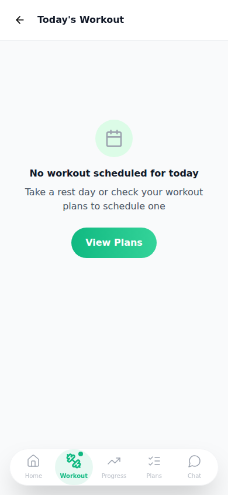
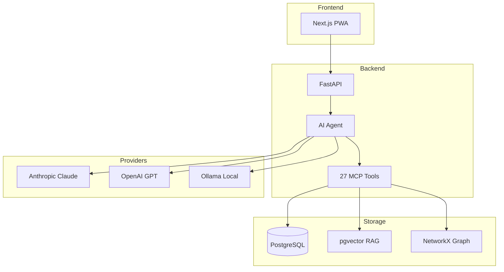

# Fitness Coach Documentation

## Screenshots

### Home Dashboard

### AI Chat

### Workout Plans

### Active Workout

## Architecture

## Documentation

- [Main README](../README.md)
- [README (Русский)](../README.ru.md)
- [Backend Documentation](../backend/README.md)
- [Frontend Documentation](../frontend/README.md)
- [Docker Deployment](../docker/README.md)
- [Contributing Guide](../CONTRIBUTING.md)
- [Security Policy](../SECURITY.md)
- [Changelog](../CHANGELOG.md)

## Quick Start

See [Main README](../README.md) for installation instructions.

## Features

- AI-powered workout planning with Claude Sonnet 4.5
- Multi-provider support (Anthropic, OpenAI, Ollama)
- Progressive Web App with offline support
- Advanced RAG system with pgvector
- Knowledge graph analysis
- Real-time streaming chat
- Workout tracking and statistics

## API Documentation

When running locally, visit:
- API Docs: http://localhost:8000/docs
- Alternative: http://localhost:8000/redoc

## Contributing

See [CONTRIBUTING.md](../CONTRIBUTING.md) for development guidelines.

## License

MIT - See [LICENSE](../LICENSE) for details.
